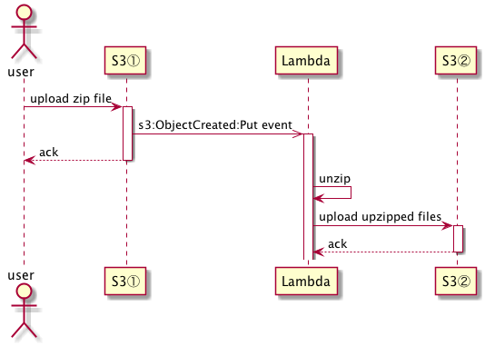

s3-unzipper-go
====

## Description
unzip uploaded zip file to another S3 bucket via AWS Lambda in Go



## Production

### prerequisites

You have to prepare credentials with proper policies.

And,

* install [aws-cli](https://github.com/aws/aws-cli)
* install [aws-sam-cli](https://github.com/awslabs/aws-sam-cli). Docker is also required. Follow the instruction [here](https://github.com/awslabs/aws-sam-cli#installation).
* install [direnv](https://github.com/direnv/direnv)
* set environment variables to [.envrc.sample](./.envrc.sample) and remove *.sample*.
  * *ZIPPED_ARTIFACT_BUCKET* is S3 bucket name. It's S3① in the sequence and should be unique globally.
  * *UNZIPPED_ARTIFACT_BUCKET* is S3 bucket name. It's S3② in the sequence and should be unique globally.
  * *STACK_BUCKET* is S3 bucket name for artifacts of SAM and should be unique globally.

### deploy

```
$ dep ensure                       # to resolve dependency
$ aws s3 mb "s3://${STACK_BUCKET}" # for artifacts of SAM
$ make deploy
```

## Local
You can test a behavior on test (`main_test.go`).

In the test, `setup` prepares 2 real S3 buckets because SAM local doesn't support local emulation of an S3.

One is for an even source that triggers an AWS Lambda and another is for a destination of unzipped artifacts.

Because S3 buckets created at the test are deleted on every test execution, idempotency is guaranteed.
